# 🎨 NotebookLM Slide Design Templates

NotebookLM으로 생성한 프레젠테이션에 적용할 수 있는 **14종 슬라이드 디자인 템플릿** 모음입니다.  
각 스타일별 4장의 예시 슬라이드(표지, 목차, 본문, 마무리)가 포함되어 있습니다.

> **NotebookLM → 스타일 가이드 문서 → 일관된 디자인 슬라이드** 워크플로우에서 참고용으로 활용하세요.

---

## 📚 템플릿 목록

### 교육 스타일

| # | 스타일 | 용도 | 미리보기 |
|---|--------|------|----------|
| 1 | **에듀테크 클린** | 교사 연수, AI·디지털 교육 |  |
| 2 | **교실 따뜻이** | 학부모 안내, 초등 교실 | 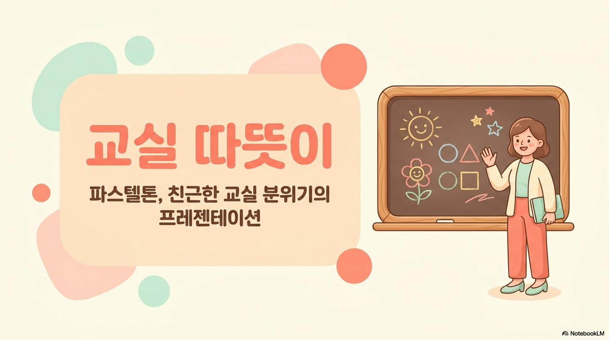 |
| 3 | **학술 포멀** | 논문, 학술 발표 | 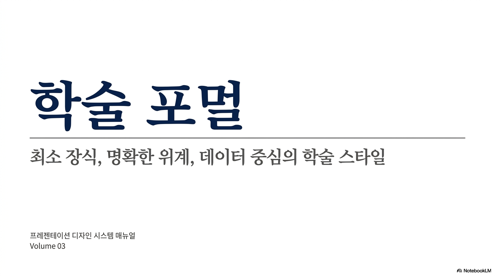 |

### 비즈니스 스타일

| # | 스타일 | 용도 | 미리보기 |
|---|--------|------|----------|
| 4 | **구글 공식** | 구글 관련 연수 | 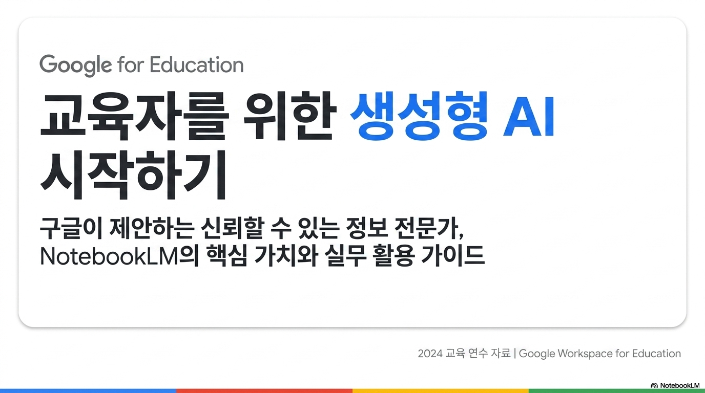 |
| 5 | **기업 심플** | 사업 보고, 회의 | 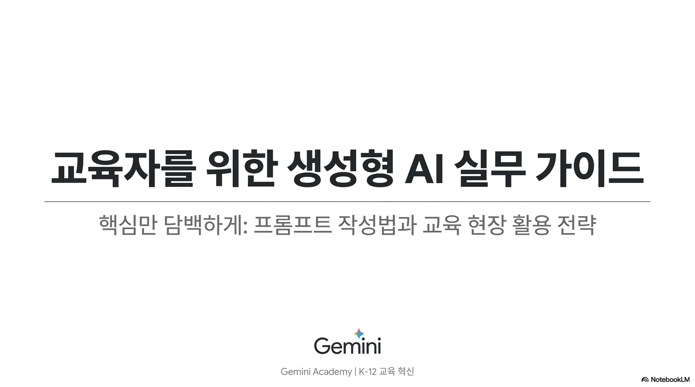 |
| 6 | **다크 프로** | 키노트, 기술 데모 | 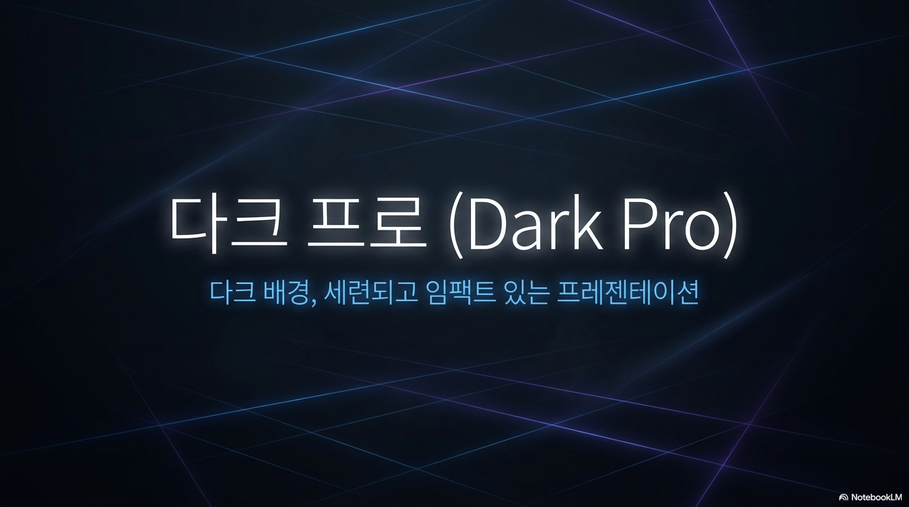 |

### 창의 스타일

| # | 스타일 | 용도 | 미리보기 |
|---|--------|------|----------|
| 7 | **칠판 스케치** | 브레인스토밍, 워크숍 | 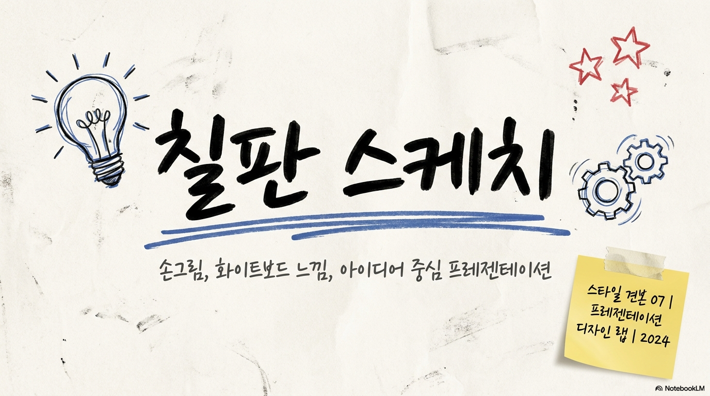 |
| 8 | **레트로 빈티지** | 역사/문화 발표 | 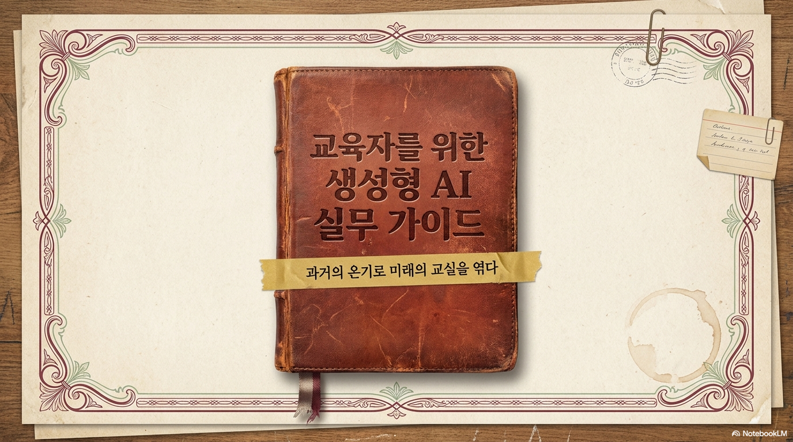 |
| 9 | **종이공예** | 초등 학생, 창의 활동 | 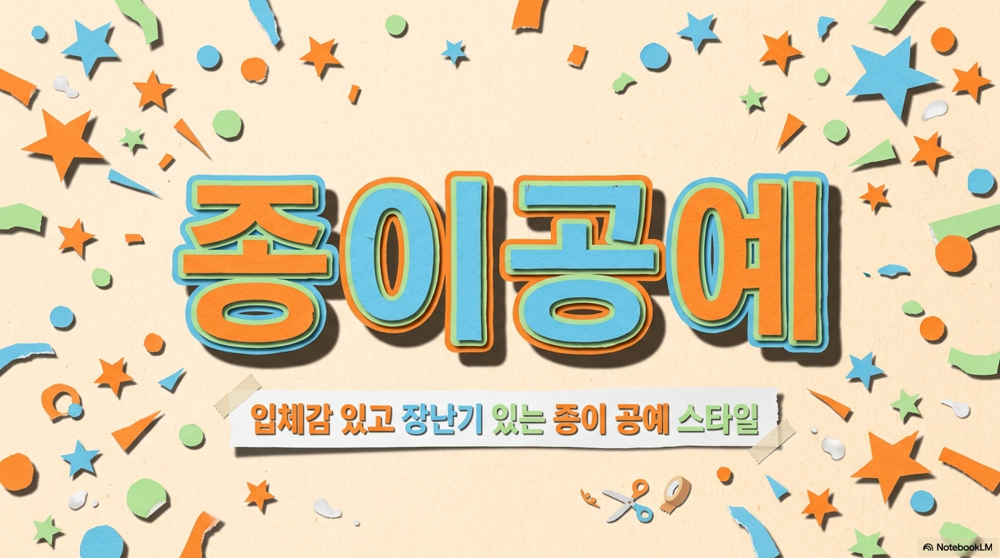 |
| 10 | **귀여움/애니** | 학생 대상, 동아리 |  |

### 아티스트 스타일

| # | 스타일 | 용도 | 미리보기 |
|---|--------|------|----------|
| 11 | **수채화** | 문학/예술, 감성 | 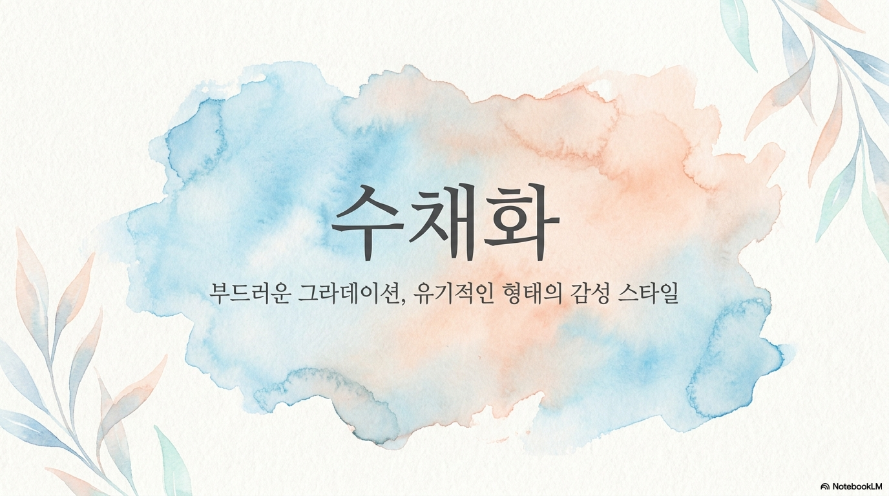 |
| 12 | **클래식 전통** | 기념식, 연혁 | 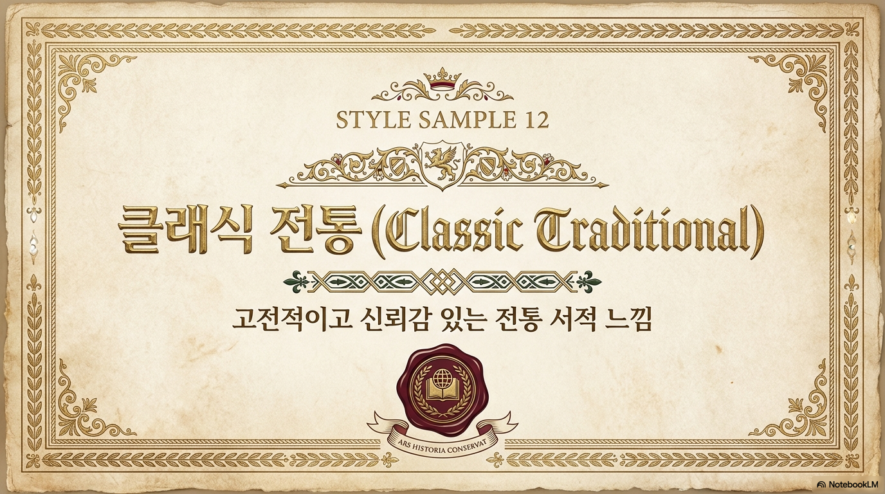 |

### 데이터/기술 스타일

| # | 스타일 | 용도 | 미리보기 |
|---|--------|------|----------|
| 13 | **데이터 시각화** | 데이터, 통계 | 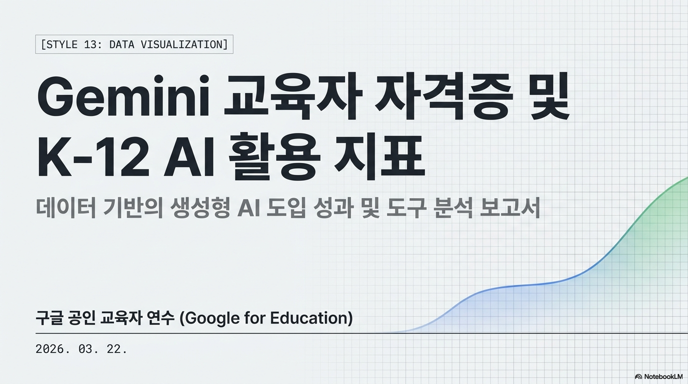 |
| 14 | **테크 퓨처** | IT, AI, 코딩 | 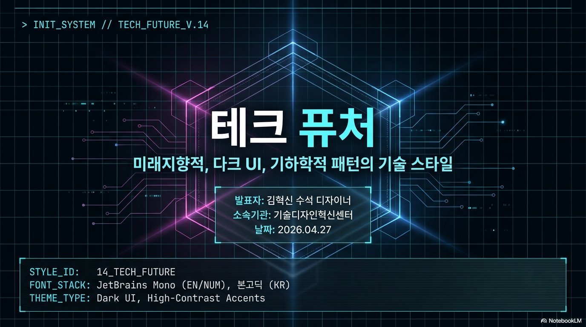 |

---

## 📂 폴더 구조

```
images/
├── 01-edutech-clean/        # 에듀테크 클린 (4장)
│   ├── slide-1.png
│   ├── slide-2.png
│   ├── slide-3.png
│   └── slide-4.png
├── 02-classroom-warm/       # 교실 따뜻이 (4장)
├── 03-academic-formal/      # 학술 포멀 (4장)
├── ...
└── 14-tech-future/          # 테크 퓨처 (4장)
```

각 폴더의 4장 구성:
- `slide-1.png` — 표지 (Title)
- `slide-2.png` — 목차 (Agenda)
- `slide-3.png` — 본문 (Content)
- `slide-4.png` — 마무리 (Closing)

---

## 🔧 활용 방법

### NotebookLM 슬라이드 제작에 적용

1. 위 테이블에서 원하는 스타일 번호를 선택
2. 해당 스타일의 **디자인 특성**(배경색, 포인트 컬러, 글꼴 등)을 스타일 가이드 문서로 작성
3. NotebookLM 노트북에 스타일 가이드를 **Source**로 업로드
4. 슬라이드 생성 시 "업로드된 스타일 가이드를 우선 반영하여 생성하라"고 지시

### 스타일 가이드 문서 예시

```markdown
# 스타일 가이드: 에듀테크 클린

## 비주얼 톤
- 배경: 흰색/연회색
- 포인트 컬러: 연파랑, 금색, 진초록
- 레이아웃: 카드형, 여백 충분

## 타이포
- 제목: 본고딕 Bold
- 본문: 인터 Regular
- 텍스트는 짧고 핵심만

## 구조
- 표지 → 목차 → 본문 → 마무리
- 슬라이드당 메시지 하나

## 금지
- 과도한 장식, 복잡한 배경
- 긴 문장, 작은 글씨
```

---

## 🚀 사전 준비 (NotebookLM 슬라이드 제작)

이 템플릿을 활용해 슬라이드를 만들려면 다음이 필요합니다:

1. **Google 계정** — NotebookLM 접근용
2. **NotebookLM** — [notebooklm.google.com](https://notebooklm.google.com)
3. **(선택) nlm CLI** — NotebookLM 명령줄 도구
   ```bash
   # 설치
   npm install -g @anthropic/nlm-cli  # 또는 해당 CLI
   
   # 슬라이드 생성 예시
   nlm slides create {NOTEBOOK_ID} --language ko --focus "주제" -y
   ```
4. **(선택) gog CLI** — Google Drive 업로드용
   ```bash
   # PPTX → Google Slides 변환
   gog drive upload presentation.pptx
   ```

---

## 📝 스타일 상세 정보

### 1. 에듀테크 클린
- **배경:** 흰색/연회색
- **포인트:** 연파랑, 금색, 진초록
- **글꼴:** 본고딕, 인터
- **적합:** 교사 연수, AI·디지털 교육, 워크숍

### 2. 교실 따뜻이
- **배경:** 크림/연노랑/연분홍 파스텔
- **포인트:** 산호색, 연복숭아, 연민트
- **글꼴:** 프리텐다드, 둥근 계열
- **적합:** 학부모 안내문, 초등 교실 자료, 가정통신문

### 3. 학술 포멀
- **배경:** 순백
- **포인트:** 남색, 짙은 회색, 단일 강조색
- **글꼴:** 본명조, 나눔명조
- **적합:** 논문 발표, 학술 대회, 연구 보고서

### 4. 구글 공식
- **배경:** 흰색
- **포인트:** 구글 파랑(#4285F4), 빨강(#EA4335), 노랑(#FBBC05), 초록(#34A853)
- **글꼴:** 구글 산스, 본고딕
- **적합:** Google 관련 연수, 구글 워크스페이스 발표

### 5. 기업 심플
- **배경:** 흰색
- **포인트:** 단일 브랜드 컬러 + 짙은 회색
- **글꼴:** 프리텐다드, 맑은 고딕
- **적합:** 사업 보고, 회의 발표, 제안서

### 6. 다크 프로
- **배경:** 짙은 남색/차콜
- **포인트:** 네온 파랑, 전보라, 흰색 텍스트
- **글꼴:** 인터, 본고딕 라이트
- **적합:** 키노트 발표, 제품 소개, 기술 데모

### 7. 칠판 스케치
- **배경:** 미색/연한 노란 종이
- **포인트:** 펜 검정, 파랑, 빨강
- **글꼴:** 손글씨 느낌, 본고딕
- **적합:** 브레인스토밍, 아이디어 발표, 워크숍

### 8. 레트로 빈티지
- **배경:** 크림/베이지/신문지 느낌
- **포인트:** 포도주색, 겨자색, 세이지 초록
- **글꼴:** 목우주나무, IBM 플렉스
- **적합:** 역사/문화 발표, 창의적 프로젝트

### 9. 종이공예
- **배경:** 밝은 파스텔
- **포인트:** 주황, 하늘색, 연두
- **글꼴:** 둥근 산세리프
- **적합:** 초등 학생 대상, 창의적 활동, 미술 관련

### 10. 귀여움/애니
- **배경:** 파스텔 분홍/연보라
- **포인트:** 진분홍, 하늘색, 레몬노랑
- **글꼴:** 둥근 글씨, 이모지 활용
- **적합:** 학생 대상, 동아리, 학교 행사

### 11. 수채화
- **배경:** 흰색/연한 질감
- **포인트:** 연파랑, 연복숭아, 연보라, 연민트
- **글꼴:** 본명조, 손글씨 계열
- **적합:** 문학/예술 발표, 감성적 주제

### 12. 클래식 전통
- **배경:** 상아색/연금색
- **포인트:** 금색, 포도주색, 진초록
- **글꼴:** 본명조, 리디바탕
- **적합:** 기념식, 연혁 소개, 공식 행사

### 13. 데이터 시각화
- **배경:** 흰색/연회색
- **포인트:** 차트 컬러 세트 (파랑, 주황, 초록, 보라)
- **글꼴:** IBM 플렉스, 본고딕 모노스페이스
- **적합:** 데이터 분석, 성과 보고, 통계 발표

### 14. 테크 퓨처
- **배경:** 짙은 회색/깊은 파랑
- **포인트:** 청록, 마젠타, 전파랑
- **글꼴:** 제트브레인 모노, 본고딕
- **적합:** IT 기술 발표, AI 프로젝트, 코딩 관련

---

## 📄 라이선스

이 템플릿은 교육 목적으로 자유롭게 활용할 수 있습니다.  
NotebookLM에서 생성된 디자인을 기반으로 합니다.

---

*Made by [proracer5576-create](https://github.com/proracer5576-create) with NotebookLM*
